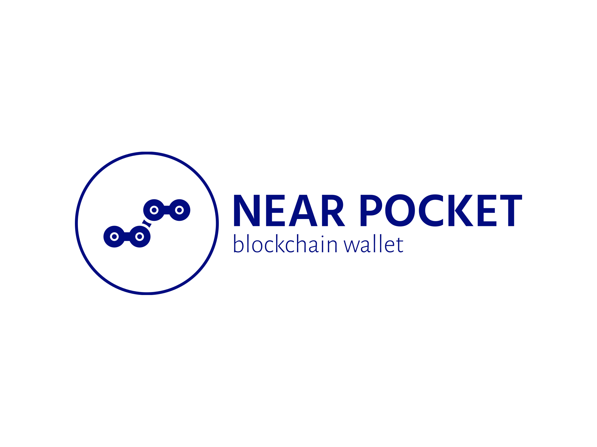
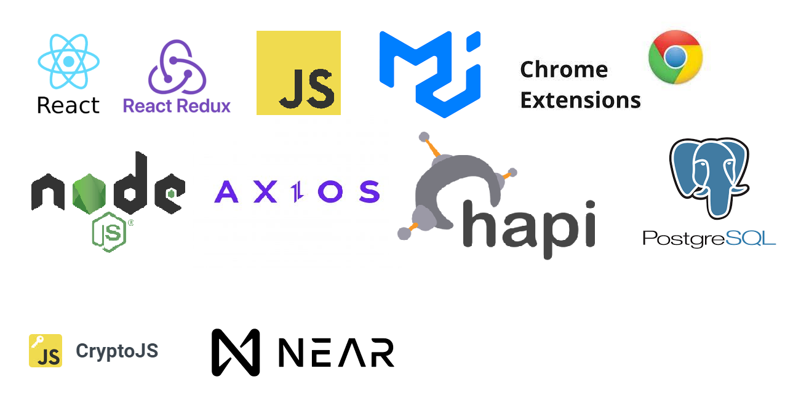

# Near Pocket : Near Protocol Wallet

## 1. 팀 소개

- 팀 명 : DH듀오
- 팀 원
    - 김다한
        - Role: Team Leader
        - Position: Frontend / Backend / Blockchain
        - Github: [https://github.com/Dahankim89](https://github.com/Dahankim89)
        - Stack: React,  Redux, JavaScript, Node.js, Hapi, postgreSQL, Web3.js, cryto, axios, near-api.js, near-seed-phrase.js
        - Contributions:
            - 니어 지갑 프론트엔드 개발
            - 니어 지갑 백엔드 개발
            - 블록체인 연동 개발
            - 니어 API 연동 개발
    - 전도후
        - Role: Team Member
        - Position: Frontend / Blockchain
        - Github: [https://github.com/adc0612](https://github.com/adc0612)
        - Stack: React,  Redux, JavaScript, 크롬 익스텐션(native HTML & javascript & css), Web3.js, cryto, axios, near-api.js, near-seed-phrase.js
        - Contributions:
            - 니어 지갑 프론트엔드 개발
            - 크롬 익스텐션 프론트엔드 개발
            - 블록체인 연동 개발
            - 웹 스타일링
        
- 개발 프로젝트
    - **니어 포켓 지갑 - 니어 프로토콜 지갑 개발**

## 2. 프로젝트 소개

### 2.1 개요

니어 포켓 프로젝트는 레이어1 블록체인의 니어 프로토콜 지갑을 제공하고, 크롬 익스텐션 기반의 지갑으로 구성되어 있습니다. 그리고 긴 길이의 16진수 주소보다 쉽게 기억하고 저장할 수 있는 지갑과 연결된 니어 프로토콜의 계정 ID를 생성해주고 그와 관련된 다 계정을 관리 및 잔액을 조회할 수 있으며, 해당 계정 ID로 코인 전송을 지원합니다. 또한 직관적이고 사용자 친화적인 UI로 구성되어 있습니다.

### 2.2 지갑 핵심 기능

- Chrome Extension 기반 지갑
- 중앙 서버 통제 없이 사용자가 직접 지갑 보유
- HD지갑 발급 및 계정 발급 기능
- 다 계정 추가 및 관리 기능
- 코인 잔액 조회 기능
- 시드 구문 / 프라이빗키로 계정 가져오기 기능
- 시드 구문으로 계정 복구 기능
- 코인 전송 기능
- 코인 받기 기능(QR코드, 계정 ID, 주소 확인)
- 시드 구문 보기 기능
- 계정 잠금 및 해제 / 로그인 기능 구현
- 트랜잭션 내역 확인 기능(개발중)

### 2.3 차별점

- 가장 보편화된 사용자 지갑 (크롬 익스텐션)으로 개발
- 실제 많이 사용하는 메타마스크, 카이카스 지갑과 유사한 기능
- 직관적인 UI와 다 계정 지갑 관리 가능
- 기억하기 쉬운 계정 ID 생성 및 전송 기능 제공
- 시드 구문, 퍼블릭키, 프라이빗키 등의 사용자 중요 정보 암호화로 보안 철저

### 2.4 기술스택

## 3. 프로젝트 추가 정보

- Wiki : [노션 정보](https://www.notion.so/DH-58ba2abb7d6f40a8b58b59ca97bbc913)

## 4. 실행 방법

- 각 디렉토리 별 README 참조

## 5. 관련 링크
- [Near Docs](https://docs.near.org/develop/welcome/) : 니어 프로토콜 공식 문서
- [Near Node Docs](https://near-nodes.io/) : 니어 프로토콜 Node 공식 문서
- [Explorer](https://explorer.near.org/) : 니어 프로토콜 Explorer
- [Octopus App Chian](https://near.org/blog/octopus-network-partners-with-near/) : Octopus 앱 체인
- [Doomslug 알고리즘](https://near.org/blog/doomslug-comparison/) : Doomslug 알고리즘