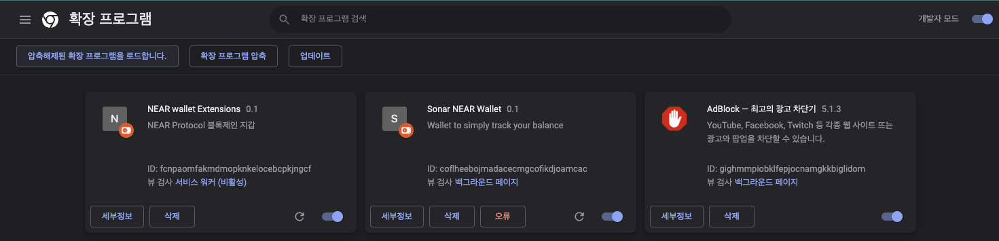

# NEAR Pocket

---

## 프로젝트 빌드

client 폴더에서 터미널을 접속하여 명령어를 입력한다.

```javascript
yarn install
```

설치 후 프로젝트를 빌드한다.
client 폴더 밑에 build 폴더가 생성되는 것을 확인 할 수 있습니다.

```javascript
yarn build
```

## 크롬 익스텐션에서 build폴더 불러오기

[chrome://extensions/](chrome://extensions/)
chrome에서 위 URL로 접속하면 크롬 확장프로그램 리스트를 확인 할 수 있다.

오른쪽 상단의 개발자 모드 토글을 선택하여 개발자 모드로 변경한다.
"압축 해제된 확장 프로그램을 로드합니다." 버튼을 눌러서 build 폴더를 지정한다.


